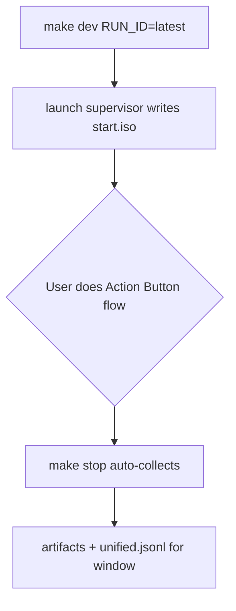

# QuietMic – Development Guide

iOS 26 voice recording app demonstrating background audio recording via AppIntents without foregrounding the UI. Built with Swift 6 strict concurrency and XcodeGen.

## Overview

Low-touch PoC MVP proving that AppIntents and iOS Shortcuts enable audio recording sessions without ever opening the app UI. All new code compiles with Swift 6 complete concurrency checking.

## Quickstart

### Dependencies

- **Required**: Xcode 16+, XcodeGen, jq, python3, macOS with iOS 26 device
- **Optional**: `xcbeautify` (prettier build output)
- **Sudo wrapper**: Run `./setup-sudo-wrapper.sh` once for passwordless `make collect`
- **Validation**: Run `make doctor` to check all dependencies and device connectivity

### Workflow Contract

Fast, non-blocking outer loop; durable, small artifacts; "latest" by default; named archives on demand.

### First Run

```bash
# Verify environment
make doctor

# Generate Xcode project (always run after modifying project.yml)
make gen

# Build, install, and launch on device (returns immediately)
make dev [DEVICE_ID=<udid>] [RUN_ID=latest|slug]

# Check app and supervisor status
make status

# Stop app and auto-collect logs
make stop

# View live console logs
make tail
```

**Important:**
- Default session is `runs/latest/` (overwritten each run)
- Use `RUN_ID=<slug>` to create archived sessions in `runs/archive/<slug>/`
- Device ID auto-selects first connected iOS device if not specified
- `make dev` returns immediately; app runs in background with supervisor
- `make stop` automatically runs `make collect` (opt-out: `STOP_NOCOLLECT=1 make stop`)

## Commands Reference

```bash
# Generate Xcode project from project.yml (ALWAYS run after modifying project.yml)
make gen

# Build, install, and launch on device (non-blocking, returns immediately)
make dev [DEVICE_ID=<udid>] [RUN_ID=latest|slug]

# Check app and supervisor status (prints supervisor state and app PID)
make status

# Stop app and auto-collect logs (clear session lock)
make stop

# Collect unified logs, crash reports, and app artifacts (uses passwordless sudo wrapper)
make collect

# View live console logs
make tail

# Build only (without install/launch)
make build-only

# Clean derived data and build artifacts
make clean

# Remove old archived runs (keeps most recent N, default 10)
make prune [N=10]

# Verify environment and dependencies
make doctor
```

## Project Structure

```
.
├── project.yml              # XcodeGen config (single source of truth)
├── Makefile                 # Build automation
├── Configs/
│   ├── Base.xcconfig       # Swift 6, strict concurrency settings
│   ├── Debug.xcconfig
│   ├── Release.xcconfig
│   ├── QuietMic.Info.plist # Generated by XcodeGen, tracked in git
│   └── QuietMic.entitlements
├── ios/QuietMic/
│   ├── App/                # Core app code
│   ├── Features/           # Feature modules
│   └── Resources/          # Assets.xcassets
├── QuietMicTests/          # Unit tests
├── QuietMicUITests/        # UI tests
├── bin/                    # Helper scripts (launch.sh, stop-app.sh, collect-logs.sh)
└── runs/                   # Session logs and artifacts
    ├── latest/             # Current/most recent session
    └── archive/            # Named archived sessions
```

**Key conventions:**
- Build policy lives in `.xcconfig` files, not YAML or Xcode GUI
- XcodeGen generates `Info.plist` and `.entitlements` in `Configs/` from inline properties in `project.yml`
- Generated plist/entitlements tracked in git to prevent merge conflicts
- In-tree DerivedData at `.derived/` for predictable paths

## Session Artifacts and Logging

Each run produces:

```
runs/latest/ (or runs/archive/<slug>/)
├── manifest.json          # Device/git metadata (device name, UDID, bundle ID, git SHA)
├── start.iso              # ISO timestamp when session started
├── stop.iso               # ISO timestamp when session stopped
├── stop.reason            # Why session ended (e.g., "sigterm" for intentional stop)
├── console.txt            # JSON lines from app stdout (supervised)
├── app_persistent.jsonl   # On-device logs (survives restarts)
├── unified.jsonl          # Unified system logs for session window (requires sudo)
├── summary.json           # Quick counts and metadata
├── artifacts/             # App Documents/ pulled from device (includes result.json + rec/*.m4a)
└── systemCrashLogs/       # Crash/Jetsam reports within time window
```

### App Logging Contract (Machine-Stable)

The app emits JSON lines to stdout (captured in `console.txt`) and to `Documents/logs/app.jsonl`:

```json
{"ev":"INTENT_FIRED","run_id":"<id>","ts":"<iso>"}
{"ev":"LA_START_OK","run_id":"<id>","ts":"<iso>"}
{"ev":"AV_SESSION_ACTIVE","category":"playAndRecord","run_id":"<id>","ts":"<iso>"}
{"ev":"REC_BEGIN","run_id":"<id>","ts":"<iso>"}
{"ev":"REC_STOP","file":"Documents/rec/…m4a","duration_s":"…","bytes":"…","run_id":"<id>","ts":"<iso>"}
{"ev":"ERROR","code":"…","message":"…","run_id":"<id>","ts":"<iso>"}
```

## Architecture & Conventions

### Agent-Intuitive Design

One obvious place for each concern:
- **Build policy**: Lives in `.xcconfig` files, not YAML
- **App metadata**: XcodeGen generates `Info.plist` and `.entitlements` from `project.yml` properties
- **Project wiring**: Single `project.yml` at root
- **Source organization**: Modular by feature, not file type

### Swift 6 Complete Concurrency

All code compiles with strict concurrency checking enabled. This catches concurrency bugs at compile time.

### Code Style

- **Swift 6 complete concurrency** enabled - all code must compile with strict checking
- No code comments unless explicitly requested or code is complex
- Follow existing patterns in neighboring files
- Use structured logging via `Logger.swift` for JSON line output to console
- Modular organization by feature, not file type

### Build System

- **XcodeGen-first**: Project files are generated, never hand-edited
- Build settings live in `.xcconfig` files, not in YAML or Xcode GUI
- Generated plist/entitlements tracked in git to prevent "modified during build" conflicts
- In-tree DerivedData at `.derived/` for predictable paths

**Critical**: Always run `make gen` after modifying `project.yml` or switching branches. XcodeGen uses `--use-cache` to prevent unnecessary file rewrites that can confuse Xcode's dependency tracking.

## Testing

### Run Tests

```bash
# Unit tests (on simulator)
xcodebuild test -scheme QuietMic -destination 'platform=iOS Simulator,name=iPhone 16 Pro'

# UI tests (on simulator)  
xcodebuild test -scheme QuietMic -destination 'platform=iOS Simulator,name=iPhone 16 Pro' -only-testing:QuietMicUITests
```

## Troubleshooting

- **Stale lock**: `guard` target auto-cleans; inspect `runs/latest/supervisor.out` if needed
- **Device unplugged**: Run `make status`, reconnect device, re-run `make dev`
- **App exited mid-run**: Run `make collect` and inspect `unified.jsonl` for RunningBoard termination reason
- **UNSUPERVISED app**: iOS may restart app after `make stop`; logs won't be captured. This is normal; the app runs outside our session. Avoid debugging unsupervised instances.
- **Failed launch (locked device)**: No `stop.iso` written; session artifacts incomplete and should not be used for analysis
- **Stop→relaunch loop**: Check no follow-up `make dev` fired; inspect `unified.jsonl` for who launched
- **Container blocked**: Run `make doctor` to check if device is locked or app not installed

## Security

- Never commit secrets or keys
- Sudo wrapper limits escalation to only `log collect` command
- All sensitive operations are read-only or device-scoped

## Appendix: Workflow Diagram



## Status Output Example

```
Session dir: runs/latest
Supervisor: RUNNING
Device app: pid=12345 (RUNNING)
```

After intentional stop:
```
Session dir: runs/latest
Supervisor: STOPPED
Device app: STOPPED (BY_AGENT)
```
